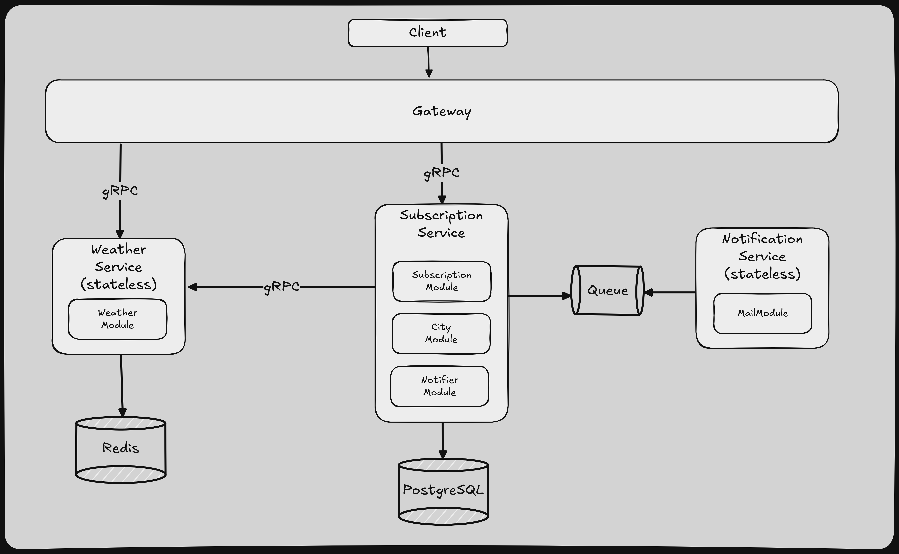

# ADR-004: Division into microservices
**Status**: Accepted    
**Date**: 06.07.2025    
**Author**: Bogdan Yarmolka

## Context
The existing application was initially implemented as a monolithic NestJS application, where all modules (subscriptions, weather, cities, notifications, mail, etc.) were part of a single codebase and deployed as one unit.
This structure allowed for rapid development in the early stages, but as the system grew, several limitations became apparent:
- Limited scalability – it’s not possible to scale parts of the system independently (e.g., weather module or email sending).
- Slower CI/CD – any change triggers tests and deployment of the entire monolith.
- Reduced fault isolation – failure in one part (e.g., weather) may crash the whole app.
- Difficult team scaling – developers must work on shared code, causing merge conflicts and coordination overhead.
- Increased complexity – all services share infrastructure (e.g., database, logging), making maintenance harder.

## Considered options
1. Fully Decoupled Microservices (five distinct microservices):
- `CityService` – manages city-related data (CRUD, geolocation, etc.)
- `WeatherService` – handles weather data retrieval and caching
- `SubscriptionService` – manages user subscriptions
- `NotifierService` – processes subscriptions, sends notifications
- `MailService` – responsible for sending emails

Pros:
- Clear separation of concerns
- Each service can scale independently based on demand
- Teams can work autonomously with strong service ownership
- Better fault isolation: failure in one domain won’t impact others

Cons:
- Increased system complexity: requires full inter-service communication setup
- Higher operational overhead (e.g., more deployments, observability per service)
- More coordination between services (e.g., Notifier now depends on Weather + Subscriptions + City)

2. Semi-Aggregated Microservices (three microservices, grouping related modules):
- `NotificationService` – a standalone service dedicated to sending emails
- `SubscriptionService` - `SubscriptionModule`, `CityModule` + `NotifierModule` – a combined service that manages users' subscriptions and notification logic
- `WeatherService` – handles fetching and caching weather data

Pros:
- Lower operational overhead (3 services instead of 5)
- Reduced inter-service communication (subscriptions + city + notifier logic live together)
- Faster implementation and migration from monolith
- MailService remains isolated — useful for retry, queuing, and rate-limiting

Cons:
- Harder to scale subdomains separately (e.g., can't scale subscriptions and notifier independently)
- Potential risk of growing back into a monolith-like service (especially in the subscription-notifier module)

## Decision
**Semi-Aggregated Microservices** was chosen.

## Consequences
### Positive
- Simplified operations – Fewer services reduce deployment and monitoring overhead.
- Efficient internal communication – Closely related modules interact without network calls.
- Independent scaling – Weather and Mail services can scale separately from others.
- Clear service boundaries – Weather and Mail services follow single-responsibility principle.
- Future flexibility – Grouped services can still be split later if needed.

### Negative
- Constrained scalability – Cannot scale Notifier separately from Subscription or City.
- Harder future decoupling – Shared data access may complicate later separation.
- Shared deployment risk – Issues in one module may impact the entire grouped service.

