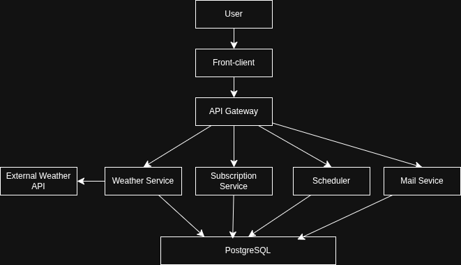

# System Design: Weather Subscription API

## Overview
It is a system that allows people to subscribe to hourly or daily weather forecast newsletters and provides an interface to receive real-time weather.

## 1. Requirements
### Functional Requirements
- User can subscribe to hourly or daily weather forecasts for a specific city
- The system sends regular messages to user via email
- User can unsubscribe from weather forecast newsletter
- The system provides an endpoint that shows the weather in real time
- The system has user web-ui for easy subscription creation

### Non-functional
- **Protection** against spam subscriptions created by other users
- Guaranteeing message delivery to users
- **Scalability** 500K users, 5M messages every day 
- Email and subscription city validation
- Availability 99.9% uptime

### Limitations
- Weather data is updated every 10–60 minutes (ref to real-time weather endpoint)
- Data may be less accurate for remote regions
- Financial constraints on creating reliable infrastructure
- Dependence on a third-party service

## 2. Load assessment
### Users & traffic 
- Active users: 100K users
- Subscriptions on one user: 2-3
- API calls: 1000 RPS(max)
- Messages: ~2M/day

### Data
- User: ~80-100 bytes
- Subscription: ~110-130 bytes
- Weather cache: ~ 120-180 bytes
- Total volume: ~200-400 MB/year in DB (users and subscription)

## 3. High-Level architecture


## 4. Detailed component design

### 4.1 Weather Module
#### Responsibilities:
- Handles REST API requests
- Data validation
- Provides weather data from external API
- Caches weather data for time interval

#### Includes:
- WeatherController
- WeatherService
- ExternalWeatherAPIService

#### Communications
- `WeatherService` - is used by `WeatherController` for getting current weather.
- `WeatherService` - is used by `WeatherNotificationService` for getting weather forecast. 
- `ExternalWeatherAPIService` is used by `WeatherService` for getting weather data from external API.

#### Using:
- External WeatherAPI.com API
- In-memory cache

#### Endpoint:
- `GET /weather?city=`

### 4.2 Subscription Module
#### Responsibilities:
- Handler REST API requests
- Data validation
- Manages (create, delete) subscription
- Generates subscription token
- Provides subscriptions information

#### Includes
- Subscription Service
- Subscription Controller
- Subscription Repository

#### Communications
- `SubscriptionService` is used by `SubscriptionController` for: create, confirm, unsubscribe subscription.
- `SubscriptionService` is used by `WeatherNotificationService` for getting subscribers.
- `SubscriptionRepository` is used by `SubscriptionService` for db access.

#### Endpoints:
- `POST /subscribe`
- `GET /confirm/:token`
- `GET /unsubscribe/:token`

### 4.3 Mail module
#### Responsibilities:
- Sends subscription confirmation emails
- Sends forecast emails

#### Includes
- MailService

#### Communications
- `MailService` is used by `SubscriptionService` and `WeatherNotificationService` for sending emails.

#### Using:
- Nest Mailer Module

#### Templates:
- `confirmation.hbs`
- `daily-forecast.hbs`
- `hourly-forecast.hbs`

### 4.4 Jobs Module
#### Responsibilities:
- Sends `DAILY/HOURLY` forecast for users

#### Includes
- WeatherNotificationService

#### Using:
- @nestjs/schedule for cron job

## 5. Database schema
### Subscription
- `id`: UUID
- `city`: TEXT
- `type`: `ENUM TYPE` (`DAILY`/`HOULY`)
- `isConfirmed`: BOOLEAN
- `user_id`: TEXT
- `created_at`: TIMESTAMP

### User
- `id`: UUID
- `email`: TEXT
- `createdAt`: TIMESTAMP

## 6. API Contracts
### 6.1 GET /weather?city=
**Description**: Get current weather for city
#### Query Params
- `city`: string

#### Responses
**200 OK**
```text
{
  "temperature": number,
  "humidity": number,
  "description": string
}
```

**400 Bad request**
**404 Not Found**

### 6.2 POST /subscribe
**Description**: Create subscription for weather forecast

#### Request
```text
POST /subscribe
Content-Type: application/json

{
  "email": string,
  "city": string,
  "frequency": HOURLY | DAILY
}
```

#### Responses
**200 OK**  
**400 Bad Invalid Input**   
**409 Conflict**

### 6.3 GET /confirm/:token
**Description**: Confirm subscription creation
#### Path Parameters
- `token`: string

#### Responses
**200 OK**  
**400 Bad Request**     
**404 Not Found**

### 6.4 GET /unsubscribe/:token
**Description**: Cancel subscription
#### Path Parameters
- `token`: string

#### Responses
**200 OK**  
**400 Bad Request**     
**404 Not Found**

## 7. Tech Stack
- Nest JS (express)
- PostgreSQL / PrismaORM
- NodeMailer
- @nestjs/schedule package for scheduling
- Jest
- Docker / Docker Compose
- Html / CSS / JS